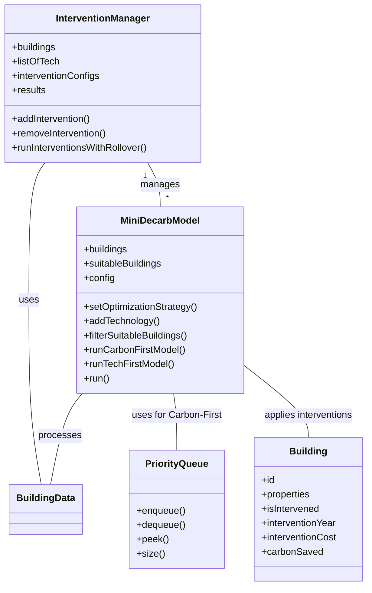
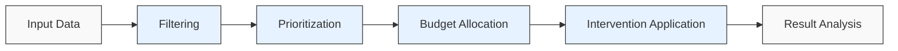
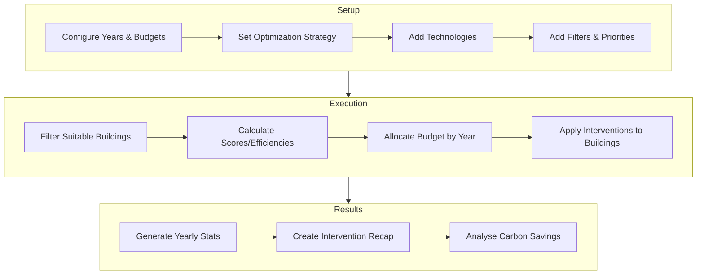
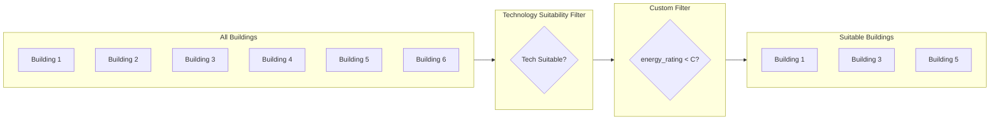
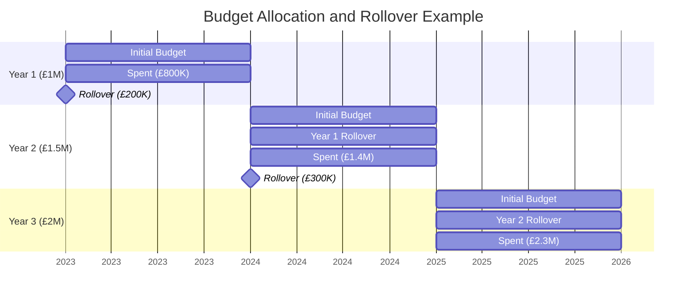

# Decarbonisation Model Documentation

## Table of Contents

1. [Introduction](#introduction)
2. [Motivation for Net Zero](#motivation-for-net-zero)
3. [Integration into Visual Analytics Dashboards](#integration-into-visual-analytics-dashboards)
4. [Model Architecture](#model-architecture)
5. [Key Classes](#key-classes)
6. [Optimization Strategies](#optimization-strategies)
7. [Intervention Workflow](#intervention-workflow)
8. [Building Selection & Prioritization](#building-selection--prioritization)
9. [Budget Allocation](#budget-allocation)
10. [Example Scenarios](#example-scenarios)
11. [Performance Considerations](#performance-considerations)
12. [Troubleshooting](#troubleshooting)

## Introduction

The decarbonisation model is designed to simulate and optimise Low Carbon Technology (LCT) interventions on buildings to reduce carbon emissions while respecting budget constraints. It supports two main optimization strategies:

1. **Carbon-First**: Prioritizes interventions with the highest carbon savings per unit cost
2. **Tech-First**: Applies a specific technology across buildings based on predefined priorities

The model allows for multi-year planning with budget rollover, different prioritisation rules, and filtering of buildings based on various attributes.

## Motivation for Net Zero

Simulation models like the mini decarbonisation model are increasingly important for planning and accelerating the deployment of Low Carbon Technologies (LCTs) to achieve net zero targets, especially in the UK. By enabling scenario analysis, these models help policymakers and planners understand the impact of different intervention strategies, budget allocations, and prioritisation rules before committing resources.

**Key benefits and novel aspects include:**

- **Data-driven decision making:** The model allows users to test and compare various LCT deployment strategies, supporting evidence-based policy and investment decisions.
- **Scenario flexibility:** Users can simulate different optimisation strategies (e.g., carbon-first vs. tech-first), budget profiles, and custom building filters, reflecting the complexity of real-world decarbonisation challenges.
- **Multi-year planning:** The ability to model budget rollover and sequential interventions mirrors actual funding cycles and policy rollouts, providing more actionable insights.
- **Targeted interventions:** By filtering and prioritising buildings, the model ensures that resources are directed where they will have the greatest impact on carbon reduction.
- **Potential Novelty:** The modular, empirical approach—where users can define custom filters, priorities, and intervention sequences—enables rapid prototyping and testing of new LCT deployment policies, which is not always possible with more rigid or aggregated models ([see e.g., ScienceDirect](https://www.sciencedirect.com/science/article/pii/S2949736122000069)).

In the UK context, where local authorities and national government face ambitious net zero targets, such simulation tools are valuable for:

- Identifying the most effective pathways to decarbonise building stock
- Optimising the use of limited public and private funding
- Supporting transparent, justifiable decision making for stakeholders
- Accelerating the adoption of innovative LCTs and policy mechanisms

By harnessing simulation, planners can better anticipate the outcomes of their interventions, reduce risks, and accelerate progress towards net zero.

## Integration into Visual Analytics Dashboards

Integrating the decarbonisation model within a visual analytics dashboard greatly enhances its practical value for decision makers and planners. Such dashboards provide an interactive environment where users can:

- **Explore intervention scenarios visually:** Users can adjust parameters (e.g., budget, technology, priorities) and immediately see the projected impact on maps, charts, and tables, supporting rapid scenario analysis.
- **Refine budget allocations dynamically:** The dashboard enables real-time experimentation with budget profiles and allocation strategies, helping users identify the most effective use of limited resources across years and regions.
- **Analyse spatial and temporal patterns:** By linking model to interactive geospatial visualisations, decision makers can pinpoint which areas or building types benefit most from specific interventions, and track progress over time, while adjusting their preferences for budget allocations.
- **Drill down to building-level details:** Interactive selection and filtering allow users to investigate individual buildings or groups, compare intervention outcomes, and tailor strategies to local needs.
- **Support collaborative decision making:** Dashboards can facilitate communication between stakeholders by making complex model results accessible and transparent, fostering consensus on intervention priorities and trade-offs.

This integration transforms the model from a static simulation tool into a powerful decision support system, enabling iterative, data-driven planning and continuous refinement of decarbonisation strategies.

## Model Architecture

The model follows a modular architecture with two main classes:

- **InterventionManager**: Manages multiple intervention configurations and sequencing
- **MiniDecarbModel**: Handles the actual simulation logic for a single intervention



### Key Data Flows

The following diagram summarises the main workflow of the mini decarbonisation model:



**Explanation:**

- **Input Data:** The model starts with a dataset of buildings and available LCT interventions.
- **Filtering:** Buildings are filtered based on suitability for specific technologies and custom criteria.
- **Prioritization:** Suitable buildings are ranked using configurable rules (e.g., carbon savings, cost, energy use).
- **Budget Allocation:** The model allocates available budget across years, applying interventions to the highest-priority buildings first.
- **Intervention Application:** Selected interventions are applied, updating building states and tracking costs and savings.
- **Result Analysis:** The model outputs a detailed summary of interventions, costs, and carbon savings for each year.

## Key Classes

### Building Class

Represents a building that can receive interventions:

```javascript
class Building {
  constructor(id, properties) {
    this.id = id;
    this.properties = properties;
    this.isIntervened = false;
    this.interventionYear = null;
    this.interventionCost = null;
    this.carbonSaved = null;
    this.score = null;
    this.numInterventions = 0;
  }
}
```

### InterventionManager Class

Manages multiple intervention configurations:

- Adds, removes, and modifies interventions
- Controls execution order of interventions
- Handles budget rollover between sequential interventions
- Provides methods for retrieving and analyzing results

### MiniDecarbModel Class

Core simulation class that:

- Filters suitable buildings based on technology requirements
- Calculates intervention costs and carbon savings
- Determines building priorities based on configured attributes
- Applies budget constraints and optimization strategies
- Generates detailed recap of interventions by year

## Optimization Strategies

### Carbon-First Strategy

In this strategy, the model:

1. Calculates potential carbon savings and costs for each building-technology pair
2. Computes carbon efficiency (carbon saved per unit cost) for each intervention
3. Uses a priority queue to process buildings with **highest** carbon efficiency first
4. Continues until the budget is exhausted or all suitable buildings are intervened

The priority queue uses a descending comparator function:

```javascript
const pq = new PriorityQueue((a, b) => b.carbonEfficiency - a.carbonEfficiency);
```

Carbon efficiency is calculated as:

```tex
$$\text{Carbon Efficiency} = \frac{\text{Carbon Saved}}{\text{Intervention Cost}}$$
```

### Tech-First Strategy

In this strategy, the model:

1. Applies a specific technology across all suitable buildings
2. Sorts buildings based on custom priority rules (e.g., energy efficiency, building size)
3. Processes buildings in order of priority until the budget is exhausted

Building priority scores incorporate both:

- Ranking position in the sorted list
- Custom scoring functions from priority rules

## Intervention Workflow

The general workflow for running an intervention is:



1. **Setup**: Configure years, budgets, technologies, filters, and priorities
2. **Filtering**: Identify suitable buildings based on technology requirements and custom filters
3. **Prioritization**: Calculate scores or efficiencies for each building
4. **Budget Allocation**: Apply interventions year by year, respecting budget constraints
5. **Results**: Generate a detailed recap of interventions and their impact

## Building Selection & Prioritization

### Filtering

Buildings can be filtered using:

1. **Technology suitability**: Based on predefined attributes in building properties
2. **Custom filters**: Created with the `createDynamicFilter` method

The diagram below illustrates the filtering process for building selection:



**Explanation:**
Buildings are first filtered for technology suitability (e.g., only those that can support a given LCT). Additional custom filters (such as energy rating thresholds) further refine the selection. Only buildings passing all filters are considered for intervention, ensuring resources are targeted effectively.

Example of creating a dynamic filter:

```javascript
const filterFunction = MiniDecarbModel.createDynamicFilter(
  "energy_rating", // attribute to filter on
  "<", // operator
  "C" // threshold value
);

model.addBuildingFilter(
  filterFunction,
  "Only buildings with energy rating below C"
);
```

### Prioritization

In tech-first mode, buildings can be prioritized using:

```javascript
model.addPriority(
  "floor_area", // attribute to prioritize on
  "desc", // order (ascending or descending)
  null, // optional custom scoring function
  2.0 // weight in final score calculation
);
```

## Budget Allocation

The model allocates budget year by year:

1. For each year, the available budget is the yearly allocation plus any rollover
2. Interventions are applied until the budget is exhausted
3. Any remaining budget can roll over to the next year
4. Results track spent budget, remaining budget, and buildings intervened per year

The following Gantt chart shows how the model manages budget allocation and rollover across multiple years:



**Explanation:**
The model supports multi-year planning, with unspent budget rolling over to subsequent years. This enables more realistic simulation of funding cycles and helps identify optimal intervention pacing for maximum carbon savings within real-world constraints.

## Example Scenarios

Below are some example scenarios demonstrating the model's capabilities:

### Scenario 1: Carbon-First with Multiple Technologies

```javascript
// Setup buildings and technologies
const buildings = [...]; // Array of building data
const techA = {
  name: 'Solar PV',
  config: {
    suitabilityKey: 'solar_suitable',
    labourKey: 'solar_labour_cost',
    materialKey: 'solar_material_cost',
    savingsKey: 'solar_carbon_savings'
  }
};
const techB = {
  name: 'Heat Pump',
  config: {
    suitabilityKey: 'heatpump_suitable',
    labourKey: 'heatpump_labour_cost',
    materialKey: 'heatpump_material_cost',
    savingsKey: 'heatpump_carbon_savings'
  }
};

// Create model
const model = new MiniDecarbModel(buildings);
model.setInitialYear(2023);
model.setYearlyBudgets([1000000, 1500000, 2000000]); // 3-year plan with increasing budget
model.setOptimizationStrategy('carbon-first');
model.addTechnology(techA);
model.addTechnology(techB);

// Add a filter for buildings over a certain size
const sizeFilter = MiniDecarbModel.createDynamicFilter('floor_area', '>', 100);
model.addBuildingFilter(sizeFilter, 'Large buildings only');

// Run model
const results = model.run();

// Example output shows buildings receiving interventions by year,
// with the most efficient carbon-saving interventions happening first
```

### Scenario 2: Tech-First with Building Priorities

```javascript
// Setup model for tech-first (focusing on Heat Pumps)
const model = new MiniDecarbModel(buildings);
model.setInitialYear(2023);
model.setYearlyBudgets([2000000, 2000000]); // 2-year plan with fixed budget
model.setOptimizationStrategy("tech-first");
model.addTechnology(techB); // Heat Pump technology

// Prioritize buildings based on multiple factors
model.addPriority("energy_consumption", "desc", null, 2.0); // Higher energy use buildings first
model.addPriority("age", "desc", null, 1.0); // Older buildings have secondary priority

// Add a filter for public buildings only
const publicBuildingFilter = MiniDecarbModel.createDynamicFilter(
  "ownership",
  "==",
  "public"
);
model.addBuildingFilter(publicBuildingFilter, "Public buildings only");

// Run model
const results = model.run();

// Example output shows public buildings receiving heat pumps in order of
// energy consumption (primary) and age (secondary), until budget is exhausted
```

### Scenario 3: Sequential Interventions with Budget Rollover

```javascript
// Create intervention manager
const manager = new InterventionManager(buildings, {
  "Solar PV": techA,
  "Heat Pump": techB,
});

// First intervention: Solar PV on commercial buildings in 2023-2024
manager.addIntervention({
  id: "commercial-solar",
  initialYear: 2023,
  yearlyBudgets: [1000000, 1500000],
  optimizationStrategy: "tech-first",
  tech: "Solar PV",
  filters: [
    {
      filterName: "Commercial buildings only",
      filterFunction: MiniDecarbModel.createDynamicFilter(
        "building_type",
        "==",
        "commercial"
      ),
    },
  ],
});

// Second intervention: Heat Pumps on residential buildings in 2025-2026
manager.addIntervention({
  id: "residential-heat-pumps",
  initialYear: 2025,
  yearlyBudgets: [2000000, 2000000],
  optimizationStrategy: "tech-first",
  tech: "Heat Pump",
  filters: [
    {
      filterName: "Residential buildings only",
      filterFunction: MiniDecarbModel.createDynamicFilter(
        "building_type",
        "==",
        "residential"
      ),
    },
  ],
});

// Run all interventions with budget rollover
const recaps = manager.runInterventionsWithRollover();

// Results show each intervention's impact, with any remaining budget
// from commercial-solar carrying over to the residential-heat-pumps
// intervention if the years align
```

## Performance Considerations

The model implements several optimization techniques:

1. **Caching**:

   - Building costs are cached to avoid recalculation
   - Filtered buildings are cached and only updated when needed
   - Available buildings are cached between years

2. **Efficient Data Structures**:

   - Priority queue for carbon-first optimization
   - Maps for fast lookups of building data

3. **Single-Pass Operations**:
   - Building scores are calculated in a single pass where possible
   - Filtering operations are combined when appropriate

## Troubleshooting

### Common Issues

1. **Few Buildings Being Intervened**:

   - Check that the priority queue in carbon-first mode is ordering properly (should use descending order)
   - Verify that building costs aren't unusually high compared to the budget
   - Ensure building properties contain the correct keys for technology suitability

2. **Unexpected Intervention Order**:

   - For carbon-first: check that carbon efficiency calculation is correct
   - For tech-first: verify priority rules and their weights

3. **Missing Carbon Savings Data**:
   - Ensure building properties include the savings keys specified in technology config
   - Check for warnings in the console about missing data

### Diagnostic Tools

The model includes logging capabilities to diagnose issues:

```javascript
// Enable detailed logging
model.setLogLevel("debug");

// Run with diagnostics
const results = model.run();
```

## Conclusion

The decarbonisation model provides a flexible framework for simulating building interventions with different strategies, priorities, and constraints. By carefully configuring the model parameters, users can explore a wide range of decarbonisation scenarios and optimise budget allocation for maximum carbon reduction impact.
